# Skin_Disease_Classifer_HAM10000
Skin Disease Classifier using the HAM10000 dataset

## Task
1. Conduct a trade study using the HAM10000 dataset on neural network models
2. Used Jetson Nano to determine how well these trained models perform on an edge device

## Prerequisite
1. Download HAM10000 dataset.
   See https://dataverse.harvard.edu/dataset.xhtml?persistentId=doi:10.7910/DVN/DBW86T
2. Upload dataset in the INPUT/HAM10000 directory
3. Download listed libraries

## Libraries
- sklearn
- matplotlib
- numpy
- glob
- PIL
- seaborn
- jtop
- pytorch
- pandas
- torchsummary
- torch
- torchvision
- json
- scipy

##  Dataset
- HAM10000 dataset
- 10,000 images
- 70/15/15 split (Training/Validation/Testing)
- Training: Resizing, Random Horizontal Flips, Random Vertical Flips, Color Jitter, Normalization
- Validation/Testing: Resizing, Normalization

## Exploratory Data Analysis (EDA)
### Age Histogram
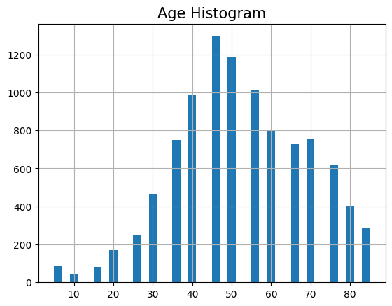

### Age vs Cell Type
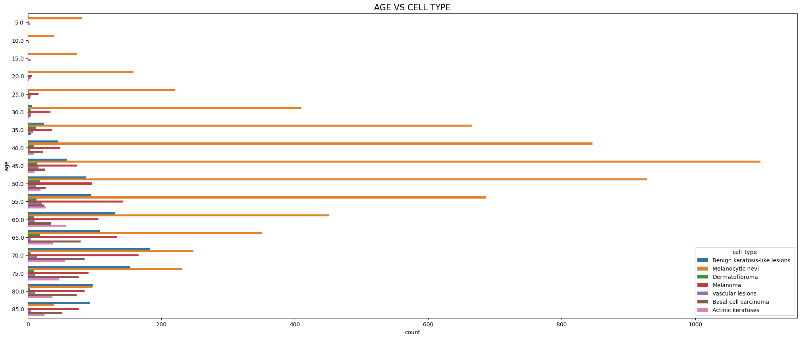

### Age vs Cell Type
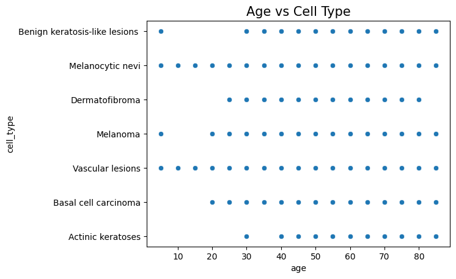

### Cell Type Count
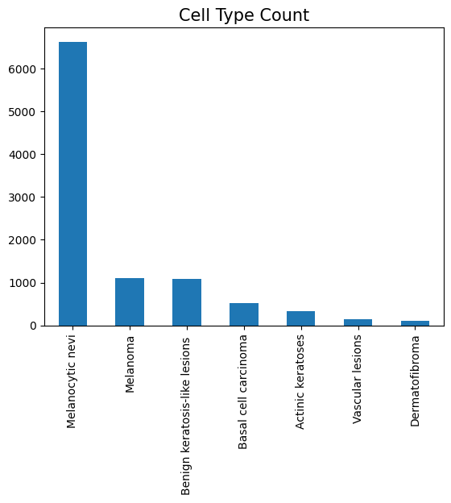

### DX & DX Type Count
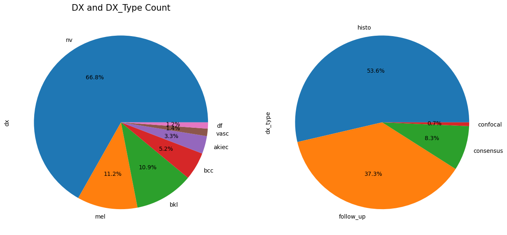

### Gender Count
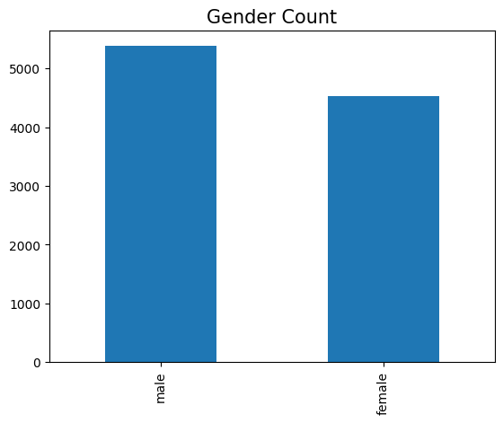

### Gender vs Cell Type
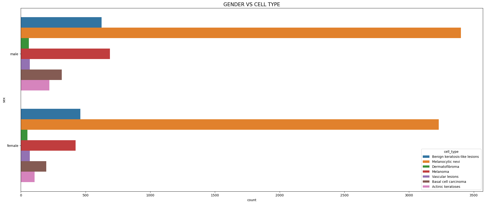

### Image Category Samples
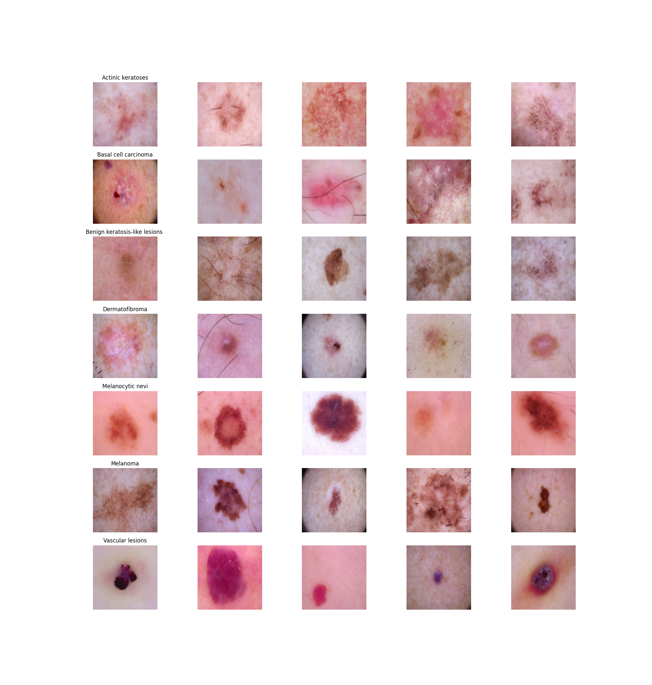

### Localization Count
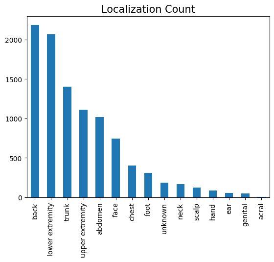

### Localization vs Cell Type
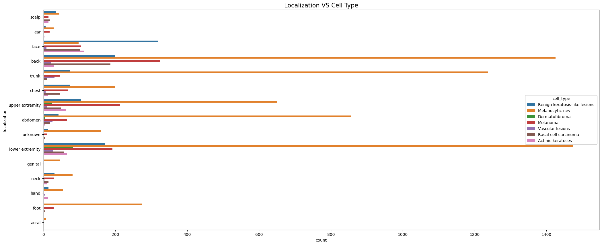

### Localization vs Gender
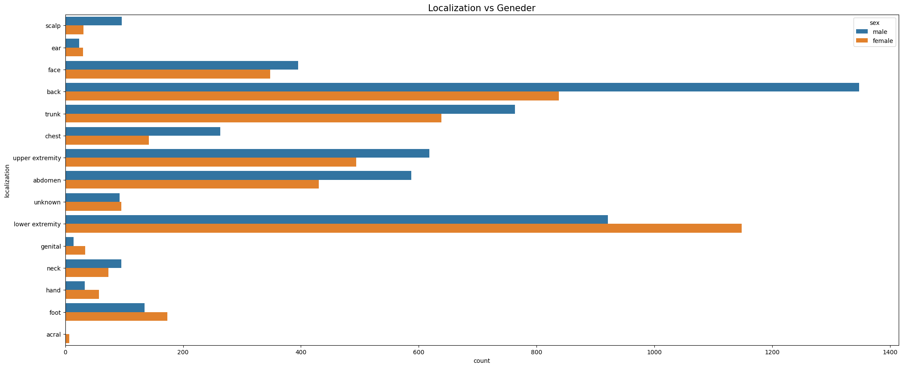

# Classifier Models
- Input: 128 by 128 image
- Output: Classifer prediction
- Models:
    - alexnet
    - efficientnet_b0
    - mobilenet_v2
    - resnet50
    - shufflenet_v2_x1_0
    - squeezenet1_1
    - vgg16

# Get Started Easily
## Train Model
### NOTE: Change arguments as needed
- python3 .\main --model alexnet
- python3 .\main --model efficientnet_b0
- python3 .\main --model mobilenet_v2
- python3 .\main --model resnet50
- python3 .\main --model shufflenet_v2_x1_0
- python3 .\main --model squeezenet1_1
- python3 .\main --model vgg16

## Test Model
### NOTE: Change arguments as needed
- python3 .\main --model alexnet            --model_name alexnet --model_path Run0
- python3 .\main --model efficientnet_b0    --model_name efficientnet_b0 --model_path Run0
- python3 .\main --model mobilenet_v2       --model_name mobilenet_v2 --model_path Run0
- python3 .\main --model resnet50           --model_name resnet50 --model_path Run0
- python3 .\main --model shufflenet_v2_x1_0 --model_name shufflenet_v2_x1_0 --model_path Run0
- python3 .\main --model squeezenet1_1      --model_name squeezenet1_1 --model_path Run0
- python3 .\main --model vgg16              --model_name vgg16 --model_path Run0
3
# Evaluation
- Manifold Representation (t-SNE)
- Jetson Stats (jtop)L Power consumption, CPU/GPU Utilization, etc
- Inference time,
- Accuracy
- Loss
- Training and Testing Time

# Folder Structure
- Helper-Functions/
    - dataset.py: Dataset loader function
    - find_dict_type.py : Pass dictionaries used in train and test function
    - find_model.py: Model loader function
    - helper_test.py: Helper functions used for test_classifer.py
    - helper_train.py: Helper functions used for train_classifer.py
- INPUT/
    - HAM10000/: Folder path that contains HAM10000 dataset
    - Test_Classifier_Dataset.csv: CSV file loaded during testing process
    - Train_Classifier_Dataset.csv: CSV file loaded during training process
    - Val_Classifier_Dataset.csv: CSV file loaded during validation process
- OUTPUT/
    - Figures/: Sample figures collecturing during Exploratory Data Analysis (EDA)
    - Models/: Train and test run data for each model
        - alexnet/
            - Test/Run*
            - Train/Run*
        - efficientnet_b0/
            - Test/Run*
            - Train/Run*
        - mobilenet_v2/
            - Test/Run*
            - Train/Run*
        - resnet50/
            - Test/Run*
            - Train/Run*
        - shufflenet_v2_x1_0/
            - Test/Run*
            - Train/Run*
        - squeezenet1_1/
            - Test/Run*
            - Train/Run*
        - vgg16/
            - Test/Run*
            - Train/Run*
- .gitignore: Ignore files
- images2csv.py: Function used to create train, validation, and test csv files
- jetson_stat_logger.py: Function used to collect jetson stats during testing
- README.md: This file
- test_classifer.py: Main test classifier function
- train_classifier.py: Main train classifier function